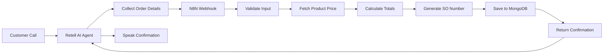

# Shiv Furniture Sales Automation System

This directory contains the automation workflows for Shiv Furniture's voice-enabled sales order system. The system integrates **Retell AI** (voice assistant) with **N8N** (workflow automation) and **MongoDB** (database) to create a seamless voice-to-order pipeline.

---

## 📁 Files Overview

### 1. **Shiv Furniture Sales Assistant (N8N).json**
**Type:** Retell AI Agent Configuration  
**Purpose:** Voice AI agent that handles customer phone calls and collects sales order information

### 2. **Shiv Furniture - Create Sales Order.json**
**Type:** N8N Workflow  
**Purpose:** Backend automation workflow that processes sales orders and stores them in MongoDB

---

## 🎯 System Architecture



---

## 🤖 Component 1: Retell AI Sales Assistant

### Configuration Details

| Property | Value |
|----------|-------|
| **Agent Name** | Shiv Furniture Sales Assistant |
| **Channel** | Voice |
| **Language** | English (US) |
| **Voice ID** | 11labs-Nico |
| **Model** | GPT-4.1 |
| **Max Call Duration** | 1 hour (3,600,000 ms) |
| **Interruption Sensitivity** | 0.9 (High) |

### Call Flow

1. **Greeting**
   - Agent greets the caller
   - Prompts: "Press 1 to create a sales order"

2. **Data Collection** (Sequential Questions)
   - ❓ **Product Name** (Required) - If unclear, asks again
   - ❓ **Quantity** (Required) - Must be a number, validates input
   - ❓ **Notes** (Optional) - Additional order information

3. **Order Processing**
   - Calls the `create_sales_order` tool
   - Sends data to N8N webhook endpoint

4. **Confirmation**
   - Speaks the response message from backend
   - Ends call politely

### Tools Available

#### 1. `end_call`
- **Type:** Built-in
- **Purpose:** Terminates the call when conversation is complete

#### 2. `create_sales_order`
- **Type:** Custom webhook
- **Method:** POST
- **Endpoint:** `https://relations-paperbacks-priorities-kit.trycloudflare.com/webhook/create-sales-order`
- **Timeout:** 120 seconds
- **Parameters:**
  ```json
  {
    "product_name": "string (required)",
    "quantity": "number (required)",
    "notes": "string (optional)"
  }
  ```
- **Response Variables:**
  - `message`: Confirmation message to speak to caller

### Agent Behavior Rules

> [!IMPORTANT]
> - Does **NOT** calculate prices or totals (handled by backend)
> - Does **NOT** generate order numbers (handled by backend)
> - Validates product name clarity before proceeding
> - Ensures quantity is numeric before proceeding
> - Speaks backend response exactly as returned

---

## ⚙️ Component 2: N8N Sales Order Workflow

### Workflow Overview

The N8N workflow consists of **11 nodes** that process sales orders from voice input to database storage.

### Node Breakdown

#### 1️⃣ **Webhook - Receive Order from Retell AI**
- **Type:** Webhook Trigger
- **Method:** POST
- **Path:** `/create-sales-order`
- **Webhook ID:** `create-sales-order`
- **Input Format:**
  ```json
  {
    "product_name": "Chair",
    "quantity": 5,
    "notes": "Urgent delivery"
  }
  ```

---

#### 2️⃣ **Validate Input Data**
- **Type:** IF Condition
- **Validations:**
  - ✅ Product name is not empty
  - ✅ Quantity is not empty
  - ✅ Quantity ≥ 1
- **Success Path:** Proceed to product lookup
- **Failure Path:** Return validation error

---

#### 3️⃣ **Return Validation Error**
- **Type:** Respond to Webhook
- **Triggered When:** Validation fails
- **Response:**
  ```json
  {
    "message": "Invalid input. Please provide valid product name and quantity greater than zero."
  }
  ```

---

#### 4️⃣ **Fetch Product Price from MongoDB**
- **Type:** MongoDB Query
- **Operation:** Find (with case-insensitive regex)
- **Collection:** `products`
- **Query Logic:** Matches product name (case-insensitive)
- **Returns:** Product document with price

---

#### 5️⃣ **Check Product Found**
- **Type:** IF Condition
- **Validation:** Price field is not empty
- **Success Path:** Calculate totals
- **Failure Path:** Return product not found error

---

#### 6️⃣ **Return Product Not Found Error**
- **Type:** Respond to Webhook
- **Triggered When:** Product doesn't exist in catalog
- **Response:**
  ```json
  {
    "message": "Product not found in our catalog. Please try a different product name."
  }
  ```

---

#### 7️⃣ **Calculate Subtotal, Tax, and Total**
- **Type:** Function (JavaScript)
- **Calculations:**
  - `line_total = price × quantity`
  - `subtotal = line_total`
  - `tax_amount = subtotal × 0.18` (18% GST)
  - `discount_amount = 0` (always zero)
  - `total_amount = subtotal + tax_amount`
- **Output:**
  ```json
  {
    "product_name": "Chair",
    "quantity": 5,
    "price": 1000,
    "line_total": 5000,
    "subtotal": 5000,
    "tax_amount": 900,
    "discount_amount": 0,
    "total_amount": 5900,
    "notes": "Urgent delivery"
  }
  ```

---

#### 8️⃣ **Get Latest Sales Order Number**
- **Type:** MongoDB Query
- **Operation:** Find
- **Collection:** `sales_orders`
- **Sort:** `so_number` descending
- **Limit:** 1 result
- **Purpose:** Retrieve the most recent SO number for incrementing

---

#### 9️⃣ **Generate Next SO Number**
- **Type:** Function (JavaScript)
- **Format:** `SO-YYYYMM-XXXX`
  - `YYYY` = Current year
  - `MM` = Current month (zero-padded)
  - `XXXX` = Sequential number (zero-padded to 4 digits)
- **Logic:**
  - If same month as latest order → increment sequence
  - If new month → reset sequence to 0001
- **Examples:**
  - `SO-202602-0001` (First order in February 2026)
  - `SO-202602-0042` (42nd order in February 2026)
  - `SO-202603-0001` (First order in March 2026)

---

#### 🔟 **Prepare MongoDB Document**
- **Type:** Function (JavaScript)
- **Purpose:** Construct complete sales order document
- **Schema:**
  ```json
  {
    "so_number": "SO-202602-0001",
    "order_date": "2026-02-01T02:07:15.000Z",
    "delivery_date": "2026-02-08T02:07:15.000Z",
    "status": "draft",
    "items": [
      {
        "product_name": "Chair",
        "quantity": 5,
        "price": 1000,
        "line_total": 5000
      }
    ],
    "subtotal": 5000,
    "tax_amount": 900,
    "discount_amount": 0,
    "total_amount": 5900,
    "notes": "Urgent delivery",
    "created_at": "2026-02-01T02:07:15.000Z",
    "updated_at": "2026-02-01T02:07:15.000Z"
  }
  ```
- **Delivery Date:** Automatically set to 7 days from order date

---

#### 1️⃣1️⃣ **Insert Sales Order to MongoDB**
- **Type:** MongoDB Insert
- **Collection:** `sales_orders`
- **Operation:** Insert document from previous node
- **Returns:** Inserted document with MongoDB `_id`

---

#### 1️⃣2️⃣ **Format Response for Retell AI**
- **Type:** Function (JavaScript)
- **Purpose:** Create voice-friendly confirmation message
- **Output:**
  ```json
  {
    "message": "Your sales order SO-202602-0001 has been created. Total amount is ₹5900.",
    "so_number": "SO-202602-0001",
    "total_amount": 5900
  }
  ```

---

#### 1️⃣3️⃣ **Return Success Response**
- **Type:** Respond to Webhook
- **Returns:** JSON response to Retell AI
- **Agent Action:** Speaks the `message` field to caller

---

## 💾 Database Schema

### Collection: `products`
```json
{
  "product_name": "string",
  "price": "number",
  // ... other product fields
}
```

### Collection: `sales_orders`
```json
{
  "_id": "ObjectId (auto-generated)",
  "so_number": "string (SO-YYYYMM-XXXX)",
  "order_date": "Date",
  "delivery_date": "Date",
  "status": "string (draft/confirmed/delivered)",
  "items": [
    {
      "product_name": "string",
      "quantity": "number",
      "price": "number",
      "line_total": "number"
    }
  ],
  "subtotal": "number",
  "tax_amount": "number (18% of subtotal)",
  "discount_amount": "number (always 0)",
  "total_amount": "number",
  "notes": "string",
  "created_at": "Date",
  "updated_at": "Date"
}
```

---

## 🚀 Setup Instructions

### Prerequisites
- N8N instance (self-hosted or cloud)
- MongoDB database
- Retell AI account
- Cloudflare Tunnel (or similar for webhook exposure)

### Step 1: Import N8N Workflow
1. Open N8N
2. Go to **Workflows** → **Import from File**
3. Select `Shiv Furniture - Create Sales Order.json`
4. Configure MongoDB credentials:
   - Node: "Fetch Product Price from MongoDB"
   - Node: "Get Latest Sales Order Number"
   - Node: "Insert Sales Order to MongoDB"
   - Credential ID: `a9aLad3I90b93HYh` (update with your MongoDB connection)

### Step 2: Expose Webhook
1. Activate the workflow in N8N
2. Copy the webhook URL from the first node
3. Expose it via Cloudflare Tunnel or ngrok
4. Example: `https://your-domain.trycloudflare.com/webhook/create-sales-order`

### Step 3: Configure Retell AI Agent
1. Log in to Retell AI dashboard
2. Create a new agent or import configuration
3. Update the webhook URL in the `create_sales_order` tool:
   ```json
   "url": "https://your-domain.trycloudflare.com/webhook/create-sales-order"
   ```
4. Publish the agent

### Step 4: Prepare MongoDB Collections
1. Create database: `shiv_furniture` (or your preferred name)
2. Create collections:
   - `products` - Add product catalog with names and prices
   - `sales_orders` - Will auto-populate with orders

### Step 5: Test the System
1. Call the Retell AI phone number
2. Follow the voice prompts
3. Provide product name, quantity, and notes
4. Verify order creation in MongoDB

---

## 🧪 Testing

### Sample Test Case

**Input (via voice):**
- Product: "Office Chair"
- Quantity: 10
- Notes: "Deliver to warehouse"

**Expected Webhook Payload:**
```json
{
  "product_name": "Office Chair",
  "quantity": 10,
  "notes": "Deliver to warehouse"
}
```

**Expected Response:**
```json
{
  "message": "Your sales order SO-202602-0015 has been created. Total amount is ₹11800.",
  "so_number": "SO-202602-0015",
  "total_amount": 11800
}
```

**MongoDB Document:**
```json
{
  "so_number": "SO-202602-0015",
  "order_date": "2026-02-01T...",
  "delivery_date": "2026-02-08T...",
  "status": "draft",
  "items": [
    {
      "product_name": "Office Chair",
      "quantity": 10,
      "price": 1000,
      "line_total": 10000
    }
  ],
  "subtotal": 10000,
  "tax_amount": 1800,
  "discount_amount": 0,
  "total_amount": 11800,
  "notes": "Deliver to warehouse",
  "created_at": "2026-02-01T...",
  "updated_at": "2026-02-01T..."
}
```

---

## 🔧 Configuration Options

### Retell AI Agent Settings

| Setting | Current Value | Description |
|---------|---------------|-------------|
| Interruption Sensitivity | 0.9 | High - Agent can be interrupted easily |
| Max Call Duration | 1 hour | Maximum call length before auto-disconnect |
| DTMF Enabled | Yes | Allows keypad input (e.g., "Press 1") |
| Voice | 11labs-Nico | Male voice from ElevenLabs |
| Model | GPT-4.1 | Latest OpenAI model for better understanding |

### N8N Workflow Settings

| Setting | Value |
|---------|-------|
| Execution Order | v1 |
| Available in MCP | No |
| Workflow Status | Inactive (activate before use) |

---

## 🛡️ Error Handling

The system handles the following error scenarios:

### 1. Invalid Input
- **Trigger:** Missing product name or quantity < 1
- **Response:** "Invalid input. Please provide valid product name and quantity greater than zero."
- **Action:** Call continues, user can retry

### 2. Product Not Found
- **Trigger:** Product name doesn't match any catalog item
- **Response:** "Product not found in our catalog. Please try a different product name."
- **Action:** Call continues, user can provide different product

### 3. Webhook Timeout
- **Trigger:** N8N doesn't respond within 120 seconds
- **Response:** Retell AI will inform user of technical difficulty
- **Action:** Check N8N workflow status and MongoDB connection

---

## 📊 Business Logic

### Tax Calculation
- **Rate:** 18% (GST)
- **Applied to:** Subtotal
- **Formula:** `tax_amount = subtotal × 0.18`

### Discount
- **Current Policy:** No discounts applied
- **Value:** Always 0
- **Future:** Can be modified in "Calculate Subtotal, Tax, and Total" node

### Delivery Date
- **Default:** 7 days from order date
- **Calculation:** `delivery_date = order_date + 7 days`
- **Modification:** Update "Prepare MongoDB Document" node

### Order Status
- **Initial Status:** `draft`
- **Possible Values:** `draft`, `confirmed`, `delivered`, `cancelled`
- **Workflow:** Status must be updated manually or via separate automation

---

## 🔐 Security Considerations

> [!WARNING]
> **Production Deployment Checklist:**
> - [ ] Secure webhook endpoint with authentication
> - [ ] Use environment variables for MongoDB credentials
> - [ ] Enable HTTPS for all webhook URLs
> - [ ] Implement rate limiting on webhook endpoint
> - [ ] Add input sanitization to prevent injection attacks
> - [ ] Configure MongoDB access controls
> - [ ] Enable Retell AI PII redaction for sensitive data
> - [ ] Set up monitoring and alerting for failed orders

---

## 📈 Future Enhancements

### Planned Features
- [ ] Multi-item orders (currently single item only)
- [ ] Customer identification via phone number
- [ ] Order modification and cancellation via voice
- [ ] Payment integration
- [ ] SMS/Email order confirmations
- [ ] Inventory checking before order creation
- [ ] Dynamic pricing and discount rules
- [ ] Multi-language support

### Suggested Improvements
- [ ] Add order confirmation step before saving
- [ ] Implement retry logic for MongoDB failures
- [ ] Create dashboard for order monitoring
- [ ] Add analytics and reporting
- [ ] Integrate with accounting software (Odoo)

---

## 🐛 Troubleshooting

### Issue: "Product not found" for valid products
**Solution:** Check MongoDB `products` collection for exact product name match (case-insensitive)

### Issue: Webhook not receiving calls
**Solution:** 
1. Verify N8N workflow is active
2. Check Cloudflare Tunnel is running
3. Test webhook URL directly with curl/Postman

### Issue: SO number not incrementing
**Solution:** Verify MongoDB query in "Get Latest Sales Order Number" returns results

### Issue: Tax calculation incorrect
**Solution:** Check "Calculate Subtotal, Tax, and Total" function for formula errors

---

## 📞 Support

For issues or questions:
- **N8N Documentation:** [https://docs.n8n.io](https://docs.n8n.io)
- **Retell AI Documentation:** [https://docs.retellai.com](https://docs.retellai.com)
- **MongoDB Documentation:** [https://docs.mongodb.com](https://docs.mongodb.com)

---

## 📄 License

This automation system is proprietary to Shiv Furniture.

---

## 🏆 Credits

**Developed for:** Odoo Hackathon - Budget Accounting System  
**Organization:** Shiv Furniture  
**Technology Stack:** Retell AI + N8N + MongoDB  
**Date:** February 2026
